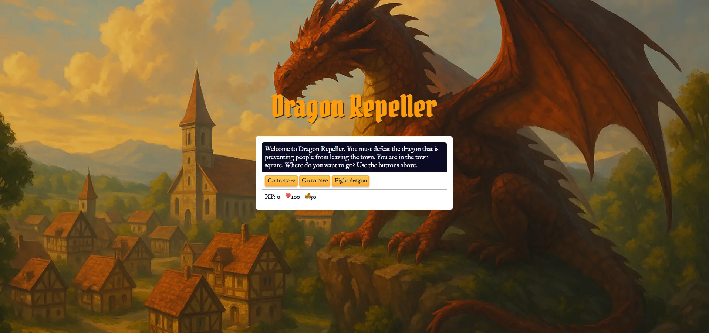

# 🐉 Role Playing Game

A fun and interactive **Role‑Playing Game** made using HTML, CSS, and JavaScript.  
Built as part of the [freeCodeCamp](https://www.freecodecamp.org/) curriculum:  
**“Learn Basic JavaScript by Building a Role Playing Game”**.

---

## 📸 New Version Preview



---

## 📸 Old Version


---

### 📦 Installation

Clone this repository (or download the ZIP):

```bash
git clone https://github.com/seu-usuario/dragon-repeller-rpg.git
```

Entre na pasta do projeto:

```bash
cd role-playing-game
```

Abra o arquivo `index.html` no navegador:

---

## 🎮 How to Play

| Location        | Actions                                               |
|----------------|--------------------------------------------------------|
| Town Square    | Visit store, explore cave, or fight the dragon         |
| Store          | Buy health or upgrade your weapon using gold           |
| Cave           | Battle random monsters (Slime, Fanged Beast)           |
| Fight Dragon   | Final boss fight                                       |
| Lose Condition | Health reaches 0                                       |
| Win Condition  | Defeat the dragon to save the kingdom! 🏆              |

---

## ✨ Features

- Inventory system: XP, health, gold, weapons
- Fight mechanics with random damage
- Gold and XP gain after battles
- Weapon upgrade logic
- Store purchasing system
- Simple UI interactions
- **💡 Easter Egg**: A secret mini-game is hidden. Can you find it?

---

## 🧠 What I Learned

- Variables, arrays, objects, and loops
- DOM manipulation (`document.querySelector`, `addEventListener`)
- Game state management with functions and conditions
- Event-driven programming
- Clean code practices and modularity
- Adding surprises with JavaScript (Easter eggs!)

---

## 📁 File Structure

```bash
role-playing-game/
├── index.html           
└── assets 
    ├── css
    ├── javascrpit
    └── images
    
```

---

## 🧩 About the Easter Egg

A secret mini-game is hidden in the game. Try clicking around or inputting a certain sequence... Finding it gives you bonus gold.

---

## 📄 License

This project is open source under the [MIT License](LICENSE).

---

## 👤 Author

Made with ❤️ by [Gustavo Ávila](https://github.com/gusavila)  
Built as part of the [freeCodeCamp JavaScript Certification](https://www.freecodecamp.org/learn/javascript-algorithms-and-data-structures-v8/)

---

## 🙌 Acknowledgments

- [freeCodeCamp.org](https://www.freecodecamp.org/)
